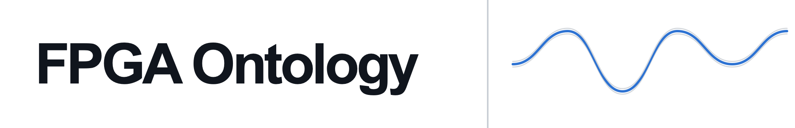
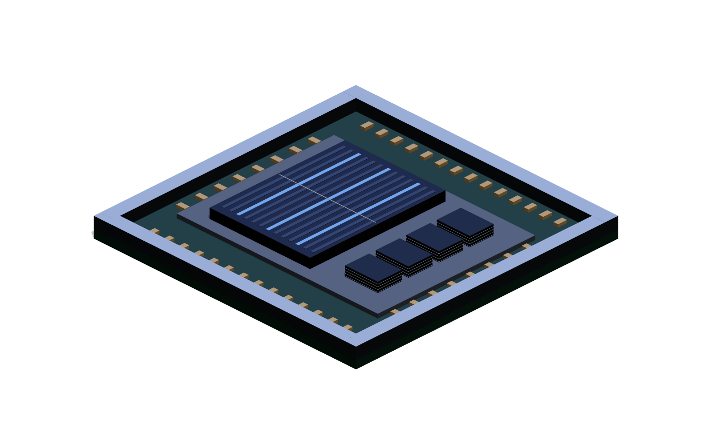
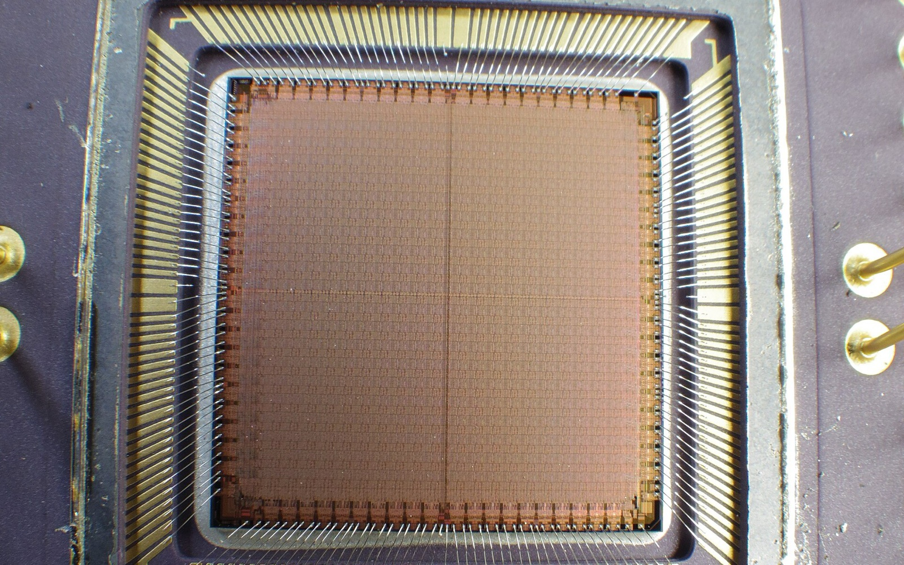
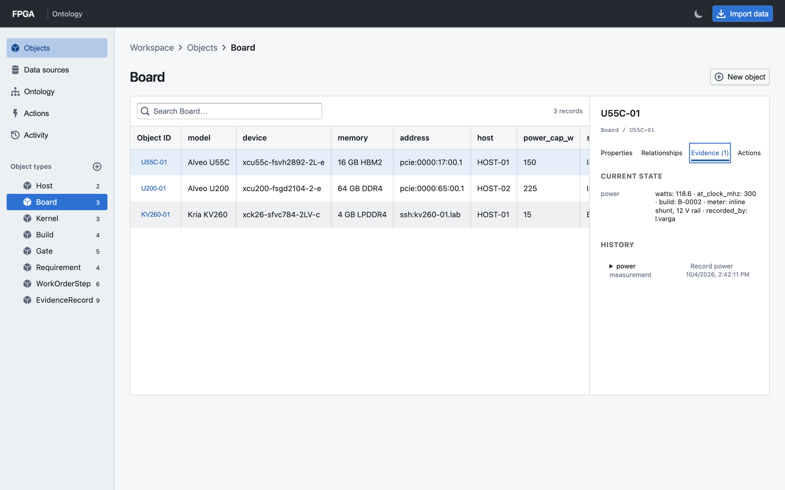
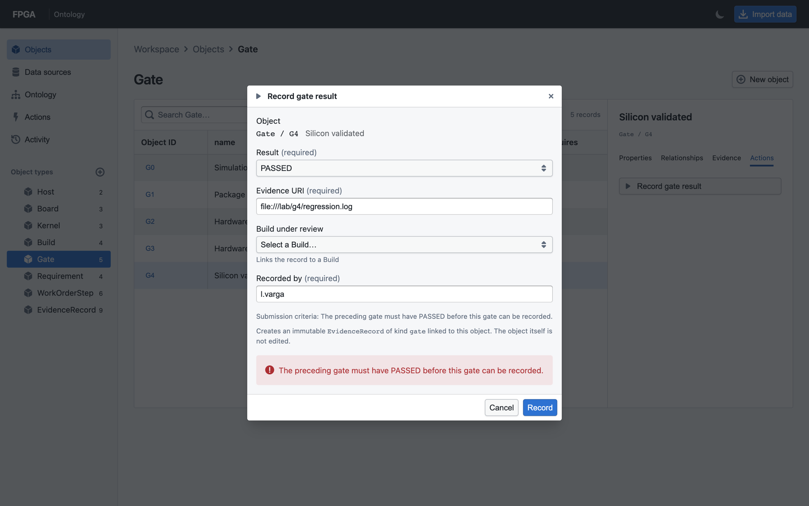
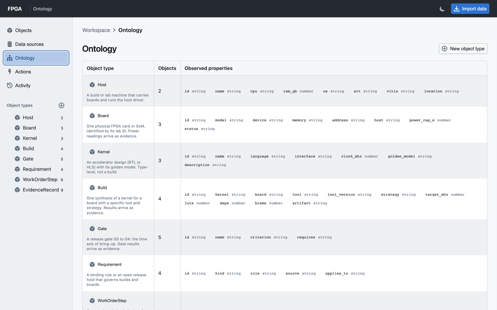
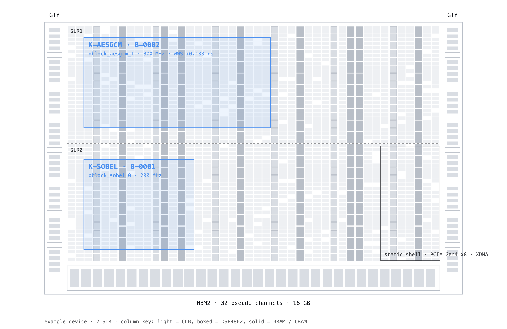

<picture><source media="(prefers-color-scheme: dark)" srcset="docs/img/banner-dark.png"></picture>

<h3 align="center">One connected model of an FPGA project that people and LLM agents read the same way</h3>

Boards, kernels, builds, gates, requirements and work-order steps are objects with stable IDs. Every dependency is an explicit link. Every result arrives as an immutable evidence record instead of an overwritten cell, so an agent pointed at the local API sees what is done, what is blocked on what, and the proof behind each claim.

Local-first and free: Python 3.10, SQLite and a browser. The UI is built on Palantir's open-source Blueprint components; this is an independent project, not affiliated with Palantir.

<picture><source media="(prefers-color-scheme: dark)" srcset="docs/img/chip3d-dark.png"></picture> 

<picture><source media="(prefers-color-scheme: dark)" srcset="docs/img/h-run-dark.png"></picture>

```sh
python3 server.py
```

Open **http://127.0.0.1:8000**. Click **Try example workspace**, or load the FPGA lab example with `python3 examples/fpga_lab/load.py` and restart. Data survives restarts in `data/workbench.db`.

<picture><source media="(prefers-color-scheme: dark)" srcset="docs/img/h-the-basics-dark.png"></picture>

| Foundry-style concept | Here |
| --- | --- |
| Data connection / dataset | CSV, JSON, or an HTTP GET endpoint returning an array |
| Ontology object type | Named collection such as Machine, Customer, or Order |
| Object | Stable ID and JSON properties |
| Link | Named, directional connection between two objects |
| Action | Reusable property update, HTTP POST to another system, or a typed **record** action that writes an EvidenceRecord |
| Lineage / history | Source attribution, retained source snapshot, and change events |

1. **Import data:** choose a source name, object type, and ID field. Paste data or select a file. A missing object type is created automatically.
2. **Objects:** search records, select an ID, and use the **Properties**, **Relationships**, and **Actions** tabs in the details panel. Link to another object—even one of a different type.
3. **Ontology:** inspect types, inferred property shapes, and all connections.
4. **Actions:** create an operation, then run it from an object's details panel.
5. **Activity:** inspect imports, before/after changes, and HTTP action responses.

<picture><source media="(prefers-color-scheme: dark)" srcset="docs/img/h-screens-dark.png"></picture>

<picture><source media="(prefers-color-scheme: dark)" srcset="docs/img/screen-evidence-dark.png"></picture>

<picture><source media="(prefers-color-scheme: dark)" srcset="docs/img/screen-gate-refused-dark.png"></picture> <picture><source media="(prefers-color-scheme: dark)" srcset="docs/img/screen-ontology-dark.png"></picture>

<picture><source media="(prefers-color-scheme: dark)" srcset="docs/img/h-example-dark.png"></picture>

`examples/fpga_lab/` is a small lab: three boards, three kernels, four builds, gates G0 to G4, requirements and the bring-up work order, with six record actions that refuse what the rules forbid. [Read the example](examples/fpga_lab/README.md).

<picture><source media="(prefers-color-scheme: dark)" srcset="docs/img/floorplan-dark.png"></picture>

<picture><source media="(prefers-color-scheme: dark)" srcset="docs/img/h-more-dark.png"></picture>

- [Guide](docs/guide.md): data formats, connecting systems, record actions, the local API, scope.
- [Development](docs/development.md): tests, frontend build, file layout.

<picture><source media="(prefers-color-scheme: dark)" srcset="docs/img/h-license-dark.png"></picture>

MIT; see [LICENSE](LICENSE). Die photograph: [FPGA chip die (Xilinx XC4010-6)](https://commons.wikimedia.org/wiki/File:FPGA_chip_die_(Xilinx_XC4010-6)_(22054207552).jpg) by htomari, [CC BY-SA 2.0](https://creativecommons.org/licenses/by-sa/2.0), cropped.
